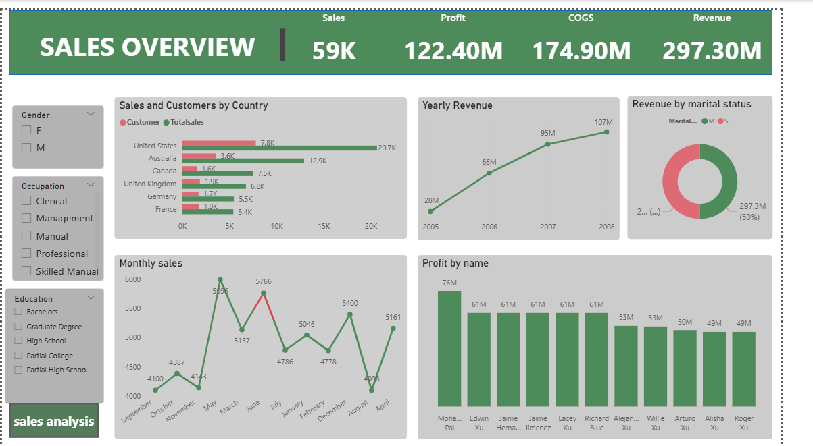

# sales-performance-dashboard
Interactive Sales Analysis Dashboard built in Power BI analysing $297M revenue  across 6 countries and 4 years — featuring KPIs, trends, and customer insights.
##  Project Overview

This project is an interactive Sales Analysis Dashboard built in *Power BI*
designed to analyse business performance across multiple countries, products,
and customer demographics over a 4-year period (2005–2008).

The goal was to transform raw sales data into clear, actionable insights that
help businesses understand where they are winning, when they perform best,
and who is buying.

---

##  Business Problem

A business had years of sales data but couldn't easily answer critical questions such as:

- Which country generates the most revenue?
- Are we growing year over year?
- Which months drive the highest sales?
- Which products are most profitable?
- What does our customer base look like?

This dashboard was built to answer all of those questions visually and interactively.

---

## 📁 Dataset

| Property | Details |
|---|---|
| *Data Type* | Sales Transactions |
| *Period Covered* | 2005 – 2008 |
| *Countries* | USA, Australia, Canada, UK, Germany, France |
| *Key Fields* | Date, Product, Revenue, Profit, COGS, Customer Demographics |

---

##  Tools Used

- *Power BI Desktop* — Dashboard building & visualisation
- *Power Query* — Data cleaning & transformation
- *DAX (Data Analysis Expressions)* — Calculated measures & KPIs

---

##  Dashboard Features

### Page 1 — Sales Overview
- *KPI Cards* — Total Sales (59K), Profit ($122.40M), COGS ($174.90M), Revenue ($297.30M)
- *Sales & Customers by Country* — Horizontal bar chart comparing customer count vs total sales
- *Yearly Revenue Trend* — Line chart showing growth from 2005 to 2008
- *Monthly Sales Performance* — Line chart tracking sales across all 12 months
- *Revenue by Marital Status* — Donut chart splitting married vs single customers
- *Profit by Customer Name* — Bar chart showing top profit-generating customers
- *Filters/Slicers* — Gender, Occupation, Education level

### Page 2 — Detailed Breakdown
- *Matrix Table* — Monthly revenue, profit & COGS broken down by country
- *Total Profit by Product* — Waterfall/line chart showing profit across all product lines

---

##  Key Insights

| # | Insight |
|---|---|
| 1 | 🇺🇸 *USA is the top market* — 20.7K sales and 7.8K customers |
| 2 | 📈 *Revenue grew 4x* — from $28M (2005) to $107M (2008) |
| 3 | 📅 *May & June are peak months* — highest monthly sales recorded |
| 4 | 🏆 *Mountain-200 Black* is the #1 profit-generating product at $6.6M |
| 5 | ⚖️ *50/50 gender split* — equal male and female customer base |
| 6 | 💰 *41% profit margin* — $122.4M profit on $297.3M revenue |

---

## 📸 Dashboard Screenshots

### Sales Overview

### Detailed Breakdown

---

##  How to Use This Project

1. Clone or download this repository
2. Open the .pbix file in *Power BI Desktop*
3. Explore the dashboard using the slicers to filter by:
   - Gender
   - Occupation
   - Education Level
4. Navigate between pages for overview and detailed breakdown

---

## 📂 Repository Structure
sales-analysis-powerbi
┣ 📂 screenshots
┃ ┣ 🖼️ sales_overview.png
┃ ┗ 🖼️ detailed_breakdown.png
┣ 📊 sales_analysis.pbix
┗ 📄 README.md

##  Author

Name: Obi Stanley
- LinkedIn: https://www.linkedin.com/in/stanley-the-analyst-9a6678326?utm_source=share_via&utm_content=profile&utm_medium=member_android
- X/Twitter:@ObiStan12266887

---

##  If you found this project helpful, please give it a star!
